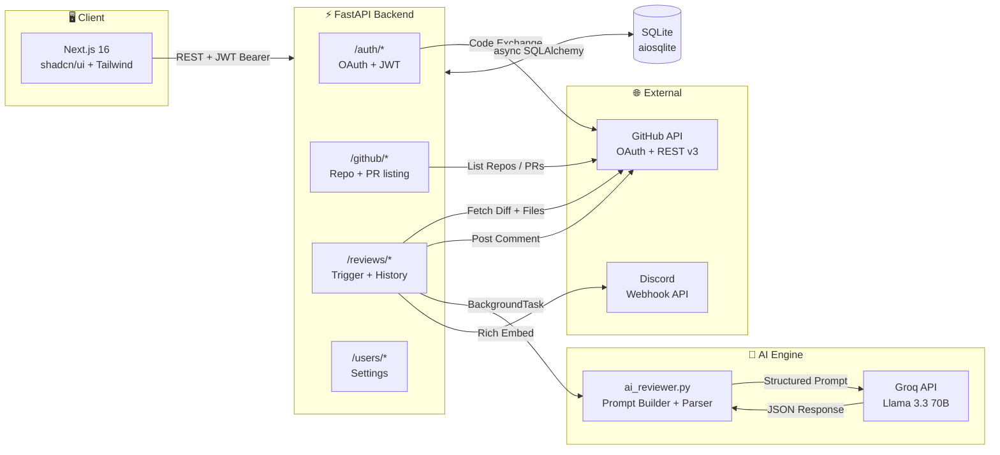
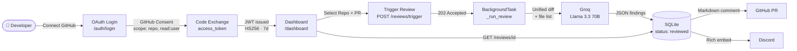
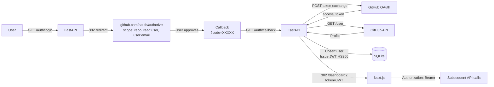
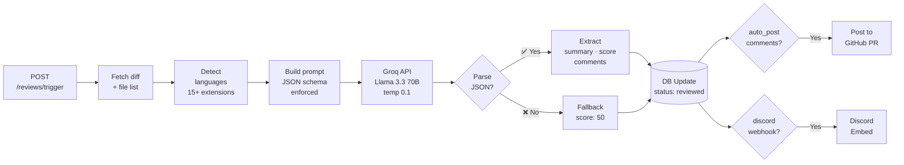
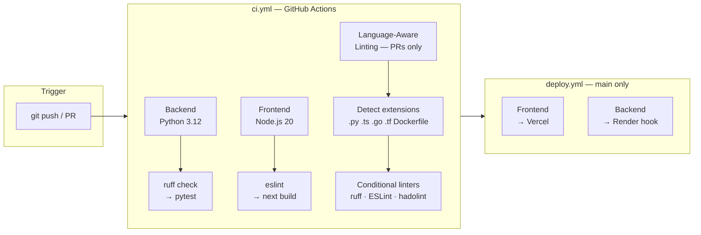
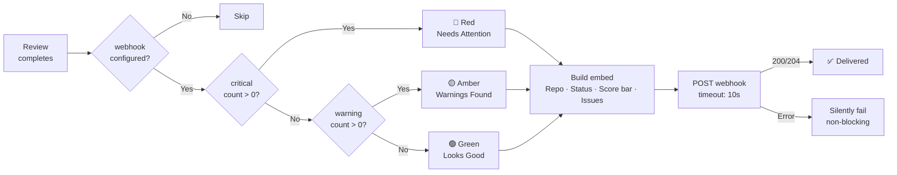

<div align="center">


<br/>

**PRism** is a self-hosted AI code review agent that connects to GitHub via OAuth, fetches pull request diffs, and runs structured analysis using **Llama 3.3 70B on Groq** — surfacing bugs, security vulnerabilities, performance bottlenecks, and code smells in seconds.

<br/>

[](https://github.com/wizardwithcodehazard/PRism/actions/workflows/ci.yml)
[](https://github.com/wizardwithcodehazard/PRism/actions/workflows/deploy.yml)


</div>

---

## Overview

Modern engineering teams review hundreds of pull requests each week. Human reviewers are inconsistent and slow — especially for cross-cutting concerns like security, performance, and code hygiene. Static analysis tools generate noise without context. AI review tools charge per seat at enterprise prices.

**PRism takes a different approach.** A developer opens a PR. PRism fetches the diff, passes it to a 70B LLM with a structured prompt, and posts an actionable review directly on GitHub — with severity levels, file locations, line numbers, and concrete fix suggestions. A Discord notification lands in the team channel simultaneously.

**Engineering philosophy:**
- **Occam's Razor** — The simplest architecture that solves the real problem. PRism avoids distributed queues and microservices until load demands it.
- **Automation-first** — Zero friction from commit to review. The system does the work; developers stay in flow.
- **ChatOps as a first-class citizen** — Reviews surface in Discord where the team already communicates.
- **Structured AI output** — The model returns typed JSON (`severity`, `category`, `file`, `line`, `message`, `suggestion`), making results machine-parseable without prompt fragility.

---

## Key Features

| Feature | Description | Status |
|---|---|---|
| **GitHub OAuth** | Full OAuth 2.0 flow — connect any repo with `repo` + `read:user` scopes | ✅ Live |
| **AI PR Analysis** | Llama 3.3 70B via Groq analyzes unified diffs for bugs, security, performance, code smells | ✅ Live |
| **Structured Review Output** | JSON schema: `severity`, `category`, `file`, `line`, `message`, `description`, `suggestion` | ✅ Live |
| **Quality Score** | 0–100 code quality score with visual progress bar | ✅ Live |
| **GitHub Comment Posting** | Auto-posts formatted Markdown review comment directly on the PR | ✅ Live |
| **Discord ChatOps** | Rich embed notifications with score, severity breakdown, and PR link | ✅ Live |
| **Language Detection** | Detects 15+ languages from file extensions, scopes AI analysis accordingly | ✅ Live |
| **Async Background Reviews** | Reviews run in FastAPI BackgroundTasks — non-blocking, returns 202 immediately | ✅ Live |
| **Configurable Analysis** | Per-user toggles: security, performance, code smell checks, auto-post to GitHub | ✅ Live |
| **Dynamic CI Linting** | GitHub Actions detects changed file types and runs language-specific linters | ✅ Live |
| **Auto-Deploy Pipeline** | Push-to-main triggers Vercel (frontend) + Render (backend) deploys | ✅ Live |
| **Slack / Teams Integration** | Parallel notification channel support | 🔜 Planned |
| **Webhook Auto-Trigger** | Trigger reviews from GitHub Actions on PR open | 🔜 Planned |

---

## System Architecture

PRism is structured in three clear layers: a Next.js frontend, a FastAPI backend with modular routers, and an AI engine powered by Groq. All GitHub interaction (OAuth, PR fetching, comment posting) flows through a dedicated client module. Reviews are processed asynchronously — the HTTP response returns immediately while the diff-fetch → AI-call → notify pipeline runs in the background.



---

## User Flow

From first login to a completed review in four steps:



---

## GitHub OAuth Flow

The full authorization code exchange — server-side, with no token exposure to the browser:



---

## AI Review Pipeline

Reviews are non-blocking. The trigger endpoint returns `202` immediately; all AI work happens in a background task:



---

## CI/CD Pipeline

Two workflows handle all automation. CI runs on every push and PR; deployment triggers only on merges to `main`:



| Job | Trigger | Steps |
|---|---|---|
| **Backend** | push / PR | `pip install` → `ruff check` → `pytest tests/` |
| **Frontend** | push / PR | `npm install` → `eslint` → `next build` |
| **Language-Aware Lint** | PR only | detect changed extensions → run relevant linter |
| **Deploy Frontend** | push to `main` | `vercel pull` → `vercel build --prod` → `vercel deploy` |
| **Deploy Backend** | push to `main` | `curl $RENDER_DEPLOY_HOOK_URL` |

---

## ChatOps Integration

Configure a Discord webhook in **Dashboard → Settings**. After each review, PRism sends a color-coded embed:



**Setup:** Go to Discord channel → Settings → Integrations → Webhooks → New Webhook. Paste the URL in PRism Settings. Done.

**Embed format:**
```
🔮 PRism Review — feat: add rate limiting middleware
Quality Score │ 71/100 [███████░░░]
Status        │ 🔴 Needs Attention
Issues        │ 🔴 1 Critical  ·  🟡 3 Warnings  ·  🔵 2 Info
```

---

## Tech Stack

<div align="center">

<table>
  <tr>
    <td align="center" width="100">
      <br/>
      <sub><b>Python 3.12</b></sub>
    </td>
    <td align="center" width="100">
      <br/>
      <sub><b>FastAPI 0.115</b></sub>
    </td>
    <td align="center" width="100">
      <br/>
      <sub><b>SQLite</b></sub>
    </td>
    <td align="center" width="100">
      <br/>
      <sub><b>Docker</b></sub>
    </td>
    <td align="center" width="100">
      <br/>
      <sub><b>Next.js 16</b></sub>
    </td>
    <td align="center" width="100">
      <br/>
      <sub><b>React 19</b></sub>
    </td>
    <td align="center" width="100">
      <br/>
      <sub><b>TypeScript 5</b></sub>
    </td>
    <td align="center" width="100">
      <br/>
      <sub><b>Tailwind v4</b></sub>
    </td>
    <td align="center" width="100">
      <br/>
      <sub><b>Vercel</b></sub>
    </td>
  </tr>
  <tr>
    <td align="center" width="100">
      <br/>
      <sub><b>GH Actions</b></sub>
    </td>
    <td align="center" width="100">
      <br/>
      <sub><b>ESLint 9</b></sub>
    </td>
    <td align="center" width="100">
      <br/>
      <sub><b>Postgres</b><br/><i>roadmap</i></sub>
    </td>
    <td align="center" width="100">
      <br/>
      <sub><b>Redis</b><br/><i>roadmap</i></sub>
    </td>
    <td align="center" width="100">
      <br/>
      <sub><b>Kubernetes</b><br/><i>roadmap</i></sub>
    </td>
    <td align="center" width="100">
      <br/>
      <sub><b>Discord</b><br/>ChatOps</sub>
    </td>
    <td align="center" width="100">
      <br/>
      <sub><b>GitHub API</b><br/>OAuth + REST</sub>
    </td>
    <td align="center" width="100">
      <br/>
      <sub><b>Linux</b><br/>Ubuntu CI</sub>
    </td>
    <td align="center" width="100">
      <br/>
      <sub><b>Prometheus</b><br/><i>roadmap</i></sub>
    </td>
  </tr>
</table>

<br/>

<!-- Secondary tooling — badges for tools without skillicons entries -->


<br/><br/>
<sub>Italicized entries are roadmap targets — the async SQLAlchemy ORM and FastAPI task layer support them as drop-in swaps.</sub>

</div>


---

## Getting Started

### Prerequisites

- Python **3.12+** · Node.js **20+**
- A **GitHub OAuth App** — free, 2 minutes to create
- A **Groq API key** — free tier at [console.groq.com](https://console.groq.com)

### 1. Create a GitHub OAuth App

Go to **GitHub → Settings → Developer Settings → OAuth Apps → New OAuth App**

| Field | Value |
|---|---|
| Homepage URL | `http://localhost:3000` |
| Authorization callback URL | `http://localhost:3000/auth/callback` |

Copy the **Client ID** and generate a **Client Secret**.

### 2. Backend

```bash
git clone https://github.com/wizardwithcodehazard/PRism.git
cd PRism/backend
cp .env.example .env
```

Edit `.env`:

```env
GITHUB_CLIENT_ID=your_client_id
GITHUB_CLIENT_SECRET=your_client_secret
GROQ_API_KEY=your_groq_key
SECRET_KEY=a-random-32-char-secret
FRONTEND_URL=http://localhost:3000
DATABASE_URL=sqlite+aiosqlite:///./prism.db
```

```bash
pip install -r requirements.txt
uvicorn main:app --reload --port 8000
# API docs → http://localhost:8000/docs
```

### 3. Frontend

```bash
cd ../frontend
npm install
echo "NEXT_PUBLIC_API_URL=http://localhost:8000" > .env.local
npm run dev
# App → http://localhost:3000
```

### 4. Docker (Backend)

```bash
cd backend
docker build -t prism-backend .
docker run -p 8000:8000 \
  -e GITHUB_CLIENT_ID=... \
  -e GITHUB_CLIENT_SECRET=... \
  -e GROQ_API_KEY=... \
  -e SECRET_KEY=... \
  -e FRONTEND_URL=http://localhost:3000 \
  prism-backend
```

### Troubleshooting

<details>
<summary><strong>OAuth redirect loop or 422</strong></summary>

The callback URL in your GitHub OAuth App must exactly match `http://localhost:3000/auth/callback`. Trailing slashes and `http` vs `https` mismatches will cause failures.
</details>

<details>
<summary><strong>Reviews always return fallback (score: 50, no comments)</strong></summary>

PRism handles Groq parse failures gracefully. If this is persistent, verify `GROQ_API_KEY` is valid and has available quota. Check the backend logs for the raw Groq response.
</details>

<details>
<summary><strong>CORS errors in browser</strong></summary>

`FRONTEND_URL` in `backend/.env` must exactly match your frontend origin including port number.
</details>

---

## Deployment

### Frontend → Vercel

1. Import `frontend/` as a Vercel project
2. Set env var: `NEXT_PUBLIC_API_URL=https://your-backend.onrender.com`
3. Update your GitHub OAuth App's callback URL to `https://your-frontend.vercel.app/auth/callback`

### Backend → Render

1. Create a **Web Service** pointing to `backend/`
2. Build: `pip install -r requirements.txt`
3. Start: `uvicorn main:app --host 0.0.0.0 --port $PORT`
4. Health check path: `/health`
5. Set all env vars from `.env.example` — update `FRONTEND_URL` to your Vercel domain

Enable auto-deploys in `deploy.yml` by setting repository variables:
```bash
gh variable set VERCEL_ENABLED --body "true"
gh variable set RENDER_ENABLED --body "true"
```

Required secrets: `VERCEL_TOKEN`, `VERCEL_ORG_ID`, `VERCEL_PROJECT_ID`, `RENDER_DEPLOY_HOOK_URL`

---

## API Reference

Interactive Swagger UI: `http://localhost:8000/docs`

| Method | Path | Description |
|---|---|---|
| `GET` | `/auth/login` | Redirect to GitHub OAuth |
| `GET` | `/auth/callback` | Handle OAuth callback, issue JWT |
| `GET` | `/auth/me` | Current user profile |
| `POST` | `/auth/logout` | Clear session |
| `GET` | `/github/repos` | List accessible repos |
| `GET` | `/github/repos/{owner}/{repo}/pulls` | List open PRs |
| `POST` | `/reviews/trigger` | Trigger AI review `{repo, pr_number}` → async |
| `GET` | `/reviews/` | Review history (limit 50, newest first) |
| `GET` | `/reviews/{id}` | Full review with AI comments |
| `GET` | `/users/settings` | Fetch user preferences |
| `PATCH` | `/users/settings` | Update preferences + webhook URL |

**Review response schema:**
```json
{
  "status": "reviewed",
  "score": 71,
  "ai_summary": "...",
  "critical_count": 1, "warning_count": 3, "info_count": 2,
  "detected_languages": ["Python", "YAML"],
  "comments": [{
    "severity": "critical",
    "category": "security",
    "file": "middleware/auth.py",
    "line": 34,
    "message": "Hardcoded secret in source",
    "description": "...",
    "suggestion": "Use environment variables."
  }]
}
```

---

## Engineering Concepts

<details>
<summary><strong>Structured LLM Output</strong></summary>

PRism constrains the model to return a strict JSON schema — not freeform text. Temperature `0.1` (near-deterministic) minimizes hallucination. A regex post-processor strips markdown fences the model adds despite explicit prohibition — a known LLM behavior. A safe fallback handles unparseable responses so the pipeline never crashes.
</details>

<details>
<summary><strong>Async Background Processing</strong></summary>

Review jobs run as FastAPI `BackgroundTask` instances. The HTTP response returns `202 Accepted` immediately — diff-fetch, AI inference, GitHub comment posting, and Discord notification all happen off the request thread. This keeps API latency under 100ms regardless of Groq response time.
</details>

<details>
<summary><strong>Dynamic Language Detection</strong></summary>

PRism infers programming languages from file extension mappings across 15+ languages — Python, TypeScript, Go, Rust, Java, C#, PHP, Kotlin, Scala, Shell, YAML, Terraform, Docker. This feeds both the AI prompt (scoping analysis) and the CI pipeline (selecting linters per PR).
</details>

<details>
<summary><strong>Diff Truncation</strong></summary>

For large diffs, PRism applies symmetric truncation: preserve the first and last `N/2` characters, insert a visible `[diff truncated]` marker. This ensures both the imports/context at the top and the latest changes at the bottom remain visible to the model within the 12,000-char budget.
</details>

---

## Scalability & Roadmap

PRism starts intentionally simple. The migration path is straightforward as load grows:

| Phase | Architecture | Handles |
|---|---|---|
| **Current** | FastAPI single process · BackgroundTasks · SQLite | ~50 concurrent reviews · 1 region |
| **Phase 2** | Gunicorn workers · Redis + Celery · PostgreSQL + pgBouncer | 500+ users · multi-region |
| **Phase 3** | Kubernetes · HPA · Managed Postgres + Redis · Prometheus + Grafana | Multi-tenant orgs · SLA-bound |

The SQLAlchemy ORM is already async-compatible — migrating from SQLite to PostgreSQL is a single `DATABASE_URL` change. The BackgroundTasks → Celery migration requires adding a broker config and decorating task functions.

**Planned integrations:**

| Integration | Effort | Value |
|---|---|---|
| Slack webhooks | Low — same embed pattern as Discord | Enterprise team reach |
| Microsoft Teams | Low — Adaptive Cards API | Enterprise prerequisite |
| GitHub App auto-trigger | Medium — webhook + signature verification | Zero-touch reviews on PR open |
| Merge gate (Check Runs API) | Medium — `block_on_critical` field already in DB | Block merges with critical issues |
| Linear / Jira | Medium — issue creation API | Auto-file tickets for critical findings |

---

## Future Scope

<details>
<summary><strong>Planned Features</strong></summary>

**GitHub Actions Auto-Trigger** — Convert to a GitHub App receiving `pull_request.opened` webhooks. The backend verifies the signature and enqueues a review job — no manual trigger needed.

**Merge Gate Enforcement** — `block_on_critical` and `block_on_warnings` are already in the `User` model. Connect them to the GitHub Check Runs API to block merges when thresholds are exceeded.

**Incremental Re-Review** — On new commits to an existing PR, diff only the changes since the last review to reduce API cost and reviewer fatigue.

**Review Export** — Export review results as structured PDF, JSON, or CSV for compliance or retrospective use.
</details>

<details>
<summary><strong>Experimental Ideas</strong></summary>

**Agentic Fix Suggestions** — Rather than commenting, propose concrete code changes as GitHub suggestions that developers can apply with one click.

**LLM Debugging Assistant** — Conversational follow-up on the review detail page: "explain this finding", "show a fixed version", "is this a false positive?"

**Analytics Dashboard** — Time-series quality score trends per repo, most common issue categories, PR merge time correlation with review score.

**RBAC for Organizations** — `admin` (org settings) · `reviewer` (trigger + view) · `viewer` (read-only dashboard).
</details>

---

## Repository Structure

```
PRism/
├── .github/
│   └── workflows/
│       ├── ci.yml              # Test · lint · build
│       └── deploy.yml          # Vercel + Render auto-deploy
│
├── backend/
│   ├── routers/
│   │   ├── auth.py             # OAuth flow (/auth/*)
│   │   ├── github.py           # Repo + PR listing (/github/*)
│   │   ├── reviews.py          # Review trigger + history (/reviews/*)
│   │   └── users.py            # Settings (/users/*)
│   ├── tests/test_api.py       # FastAPI TestClient integration tests
│   ├── ai_reviewer.py          # Groq prompt builder · parser · GitHub comment formatter
│   ├── auth_utils.py           # JWT create + validate · get_current_user
│   ├── config.py               # Pydantic Settings — all env vars
│   ├── database.py             # Async SQLAlchemy engine · session factory
│   ├── discord_notify.py       # Discord webhook embed builder
│   ├── github_client.py        # GitHub OAuth helpers + REST API client
│   ├── main.py                 # FastAPI app · CORS · router registration
│   ├── models.py               # ORM models: User · Review
│   ├── Dockerfile
│   └── requirements.txt
│
├── frontend/
│   ├── app/
│   │   ├── auth/callback/      # OAuth token handler
│   │   ├── dashboard/
│   │   │   ├── new-review/     # Repo + PR selector
│   │   │   ├── review/[id]/    # Review detail — findings, score, comments
│   │   │   ├── reviews/        # Review history list
│   │   │   └── settings/       # User preferences + webhook config
│   │   └── page.tsx            # Landing page
│   ├── components/ui/          # shadcn/ui primitives
│   └── lib/                    # API client · utils
│
├── assets/banner.png
└── README.md
```

---

## Contributing

PRs are welcome. Before opening one:

```bash
# Backend
cd backend && ruff check . && pytest tests/ -v

# Frontend
cd frontend && npm run lint && npm run build
```

Commit format: `type(scope): description` — e.g., `feat(ai): add retry logic for Groq failures`

---

<div align="center">

Built with FastAPI · Next.js · Groq · GitHub API

</div>
